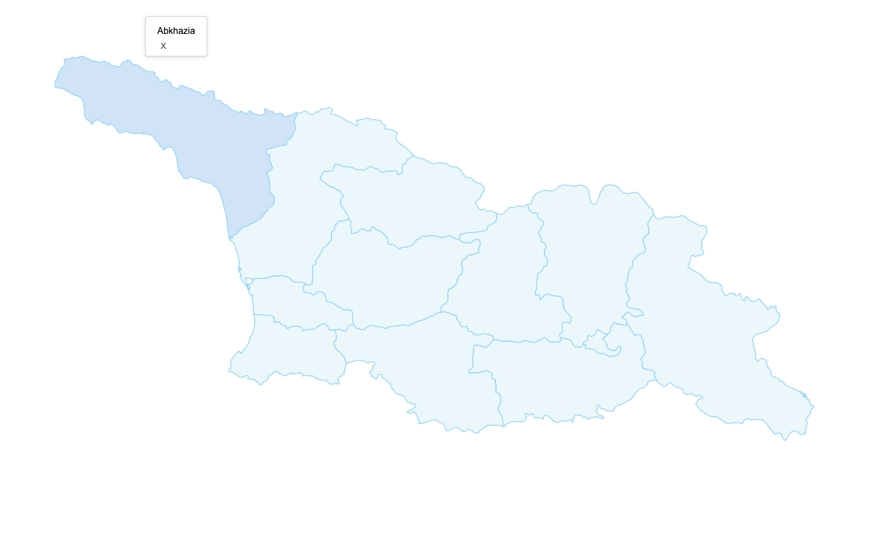

# Georgian Interactive SVG Map with Modals

This is a web-based interactive tool that displays a detailed SVG map of Georgia. Each region on the map is clickable and responds to user interactions: when you hover over a region, it highlights, and clicking on it opens a modal window with additional information about that region. The map is built using modern web technologies (HTML, CSS, and ES6 JavaScript), providing users with a seamless and engaging experience.




## Features

- **Interactive Regions:**  
  Hover over a region to see it highlighted; click on a region to open a modal with more details.
- **Responsive Design:**  
  The tool is built to work on various devices and screen sizes.
- **Accessibility:**  
  Uses semantic HTML and accessible design practices to ensure usability for all users.

## Getting Started

To run the interactive map locally:

1. **Clone the Repository:**
   ```bash
   git clone git@github.com:sosog/interactive-svg-map-of-georgia-with-modals.git
